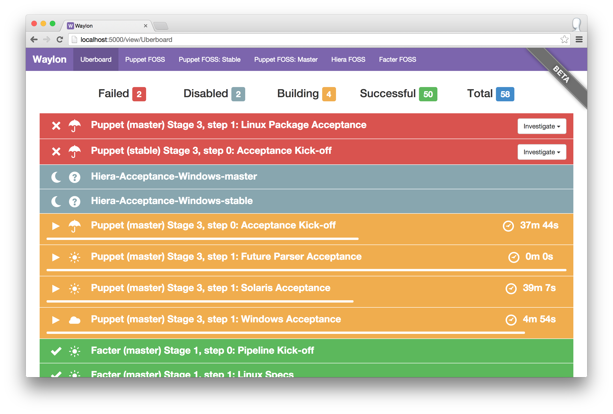

# Waylon
[](https://badge.fury.io/rb/waylon)
[](http://waffle.io/rji/waylon)

Waylon is a dashboard to display the status of your Jenkins builds.

  * Project page: http://rogerignazio.com/projects/waylon
  * Source code: https://github.com/rji/waylon

## Overview
  * Displays individual jobs, or all of the jobs in a view (or nested view)
  for one or more Jenkins instances
  * Displays build stability for each job (sunny, cloudy, raining)
  * Groups jobs by building, failed, and successful, and displays job counts for each
  * Mark a failed build as 'under investigation' (requires the
  [description-setter](https://wiki.jenkins-ci.org/display/JENKINS/Description+Setter+Plugin)
  plugin)
  * Multiple views allows for multiple teams to utilize a single Waylon install
  * Nirvana mode displays a calming image of Oregon if all your jobs are green
  * Trouble mode displays an image of a forest fire if more than
  `trouble_threshold` jobs are red (default is disabled)

## Setup
Clone the repo from GitHub:

```
git clone https://github.com/rji/waylon
```

Or install via Rubygems:

```
gem install waylon
```

Generally, the master branch _should_ work, but it's also where we do most of
our development. If you want to check out a specific release, try:

```
git clone https://github.com/rji/waylon -b v2.1.3
```

## Configuration
Waylon will first attempt to use a configuration file located at
`/etc/waylon.yml`. However, if one does not exist, it will fallback to looking
for the config relative to the application root, at `config/waylon.yml`.

An example config file is located at `config/waylon.yml.example`.

For logging, Waylon will first attempt to log to `/var/log/waylon`, if it
exists. Otherwise, it will fallback to logging relative to the application root,
in the `logs/` directory. Two files will be created: `waylon.out` and
`waylon.err`, for stdout and stderr (respectively).

Modify `waylon.yml` to point to your Jenkins install, and enter any job
names or Jenkins views that you wish to display. For the most part, it's
self-explanatory, but here's an example for a few of
[Puppet Labs](http://www.puppetlabs.com)' FOSS projects:

```yaml
---
config:
  refresh_interval: 120
views:
  'Puppet Labs - FOSS':
    'pl-jenkins':
      url: 'https://jenkins.puppetlabs.com'
      jobs:
        - 'Puppet-Specs-master'
        - 'Facter-Specs-master'
        - 'Hiera-Specs-master'
```

## Deployment
### Docker
The easiest way to deploy Waylon is by using the
[rogerignazio/waylon](https://hub.docker.com/r/rogerignazio/waylon) Docker
image, setting the `$WAYLON_CONFIG` environment variable to a URL containing a
`waylon.yml` configuration file, like so:

```
$ docker run    \
  -p 8080:8080  \
  -e WAYLON_CONFIG="https://gist.githubusercontent.com/rji/60fe93333247ef46542e/raw/waylon.yml" \
  rogerignazio/waylon:v2.1.4
```

Otherwise, if you'd like to build your own image that contains `waylon.yml` so
that you don't need to fetch it at container run time, you can base your image
off of mine:

```Dockerfile
FROM rogerignazio/waylon:v2.1.4
MAINTAINER You <you@example.com>

ADD myconfig.yaml /usr/local/waylon/config/waylon.yml
CMD bundle exec foreman start
```

### Marathon (Mesos / DCOS)
To complement the Docker image, there is an example `marathon.json` included
in the root of this repository. To deploy Waylon on
[Marathon](https://mesosphere.github.io/marathon), set the value of
`$WAYLON_CONFIG` and create a new Marathon application like so:

```
$ curl -H 'Content-Type: application/json' -X POST -d @marathon.json http://marathon.example.com/v2/apps
```

### On a dedicated server
If you're using Puppet, you might want to check out the
[rji/waylon](https://forge.puppetlabs.com/rji/waylon) Puppet module.

For deploying the app, we have built-in support for Unicorn, a popular Ruby
application server. A standard configuration is located at `config/unicorn.rb`
and shouldn't need to be modified under normal circumstances.

Otherwise, running `bundle exec foreman start` will launch memcached and Unicorn
as specified in the `Procfile`.

## Memcached
Waylon can use memcached to reduce the number of requests against Jenkins.
Environments where many users are using Waylon or many jobs are displayed
should use this caching to deduplicate requests made against the Jenkins API.

To enable memcached, add the `memcached_server` setting to the `config` section
of waylon.yml:

```yaml
---
config:
  refresh_interval: 120
  memcached_server: './tmp/memcached.sock'
```

The default Procfile will start memcached to listen on the Unix socket
`./tmp/memcached.sock` for connections from Waylon. When run locally, you
should use Foreman to start up both Waylon and memcached.

```
$ bundle exec foreman start
12:52:56 web.1      | started with pid 9032
12:52:56 memcache.1 | started with pid 9033
```

## Screenshots



## Development
See the [CONTRIBUTING](CONTRIBUTING.md) doc.

### Using foreman

For development, running `foreman` will launch the app, with memcached, on Port 5000:

```
$ bundle exec foreman start --procfile Procfile.development
10:36:33 web.1      | [2014-05-15 10:36:33] INFO  WEBrick 1.3.1
10:36:33 memcache.1 | Starting memcached
10:36:33 web.1      | [2014-05-15 10:36:33] INFO  ruby 2.1.1 (2014-02-24) [x86_64-darwin13.0]
10:36:33 web.1      | [2014-05-15 10:36:33] INFO  WEBrick::HTTPServer#start: pid=41331 port=9292
```
### Using foreman on Windows

For development, running `foreman` will launch the app on Port 5000:

``` powershell
PS> bundle exec foreman start --procfile Procfile.windows
10:20:43 web.1  | started with pid 13472
10:20:46 web.1  | [2017-01-17 10:20:46] INFO  WEBrick 1.3.1
10:20:46 web.1  | [2017-01-17 10:20:46] INFO  ruby 2.3.0 (2015-12-25) [x64-mingw32]
10:20:46 web.1  | [2017-01-17 10:20:46] INFO  WEBrick::HTTPServer#start: pid=5148 port=5000
```

### Using rack
For development, running `rackup` will launch the app with WEBrick on port 9292:

```
$ bundle exec rackup
[2014-05-15 10:36:33] INFO  WEBrick 1.3.1
[2014-05-15 10:36:33] INFO  ruby 2.1.1 (2014-02-24) [x86_64-darwin13.0]
[2014-05-15 10:36:33] INFO  WEBrick::HTTPServer#start: pid=41331 port=9292
```

## Author
Roger Ignazio (me@rogerignazio.com)

## License
Apache License, Version 2.0

## Credits
This application makes use of and/or re-distributes the following open source
software:
  * [Backbone.js](http://backbonejs.org/)
  * [Bootstrap](http://getbootstrap.com)
  * [Handlebars.js](http://handlebarsjs.com)
  * [jenkins_api_client](https://github.com/arangamani/jenkins_api_client)
  * [jQuery](http://jquery.com)
  * [Sinatra](http://www.sinatrarb.com)

This application also includes the following content that was released under the
[Creative Commons Attribution (CC BY)](http://creativecommons.org/licenses/)
license. Images were cropped to 1920px by 1080px.
  * [Central Oregon Landscape](https://www.flickr.com/photos/ex_magician/3196286183) by Michael McCullough
  * [Day 105: Oregon Coast Range](https://www.flickr.com/photos/lorenkerns/8651732785) by Loren Kerns
  * [Oregon Coastline -4](https://www.flickr.com/photos/intherough/5397108428) by Wendell
  * [Mt. Hood, Oregon](https://www.flickr.com/photos/tsaiproject/9943809254) by tsaiproject
  * [Astoria, Oregon](https://www.flickr.com/photos/goingslo/11522920406) by Linda Tanner
  * [Oregon Autumn Part 4](https://www.flickr.com/photos/31246066@N04/4030400633) by Ian Sane
  * [Multnomah Falls](https://www.flickr.com/photos/johnniewalker/12660211844) by John Tregoning
  * [20130817-FS-UNK-0069](https://www.flickr.com/photos/usdagov/9773088691) by U.S. Department of Agriculture
  * [Wildfire in the Pacific Northwest](https://www.flickr.com/photos/blmoregon/8776249150) by Bureau of Land Management Oregon / Washington
  * [Wildfire](https://www.flickr.com/photos/npsclimatechange/14503287131) by NPS Climate Change Response
  * [20130817-FS-UNK-0059](https://www.flickr.com/photos/usdagov/9707378699) by U.S. Department of Agriculture
  * [20130817-FS-UNK-0027](https://www.flickr.com/photos/usdagov/9626930351) by U.S. Department of Agriculture
  * [20130701-FS-UNK-0018](https://www.flickr.com/photos/usdagov/9294755604) by U.S. Department of Agriculture
  * [20130816-FS-UNK-0007](https://www.flickr.com/photos/usdagov/9623969360/) by U.S. Department of Agriculture
